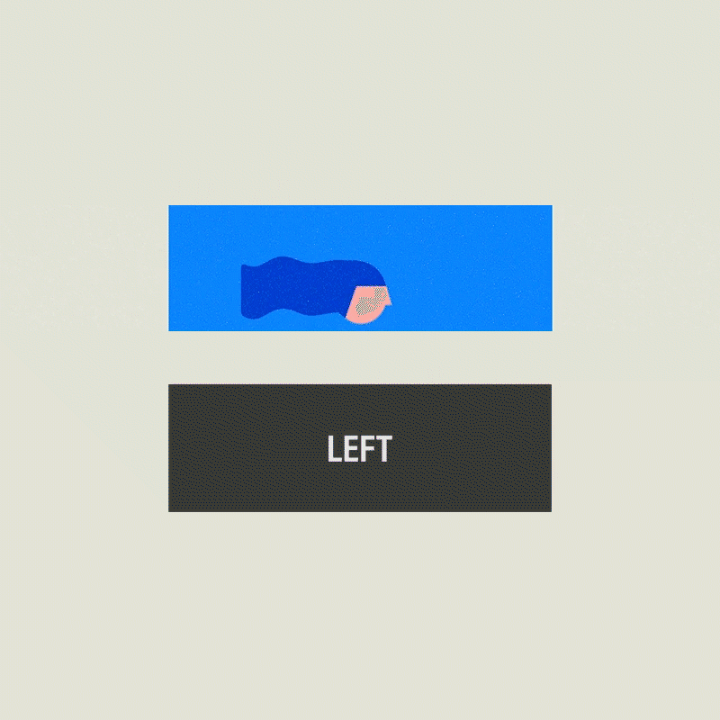
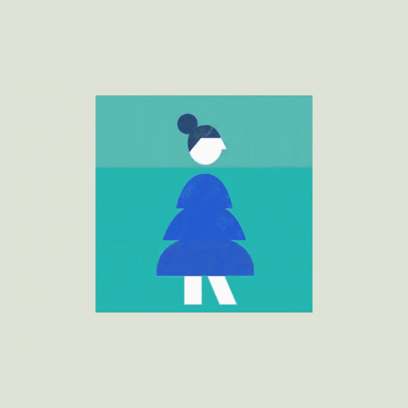
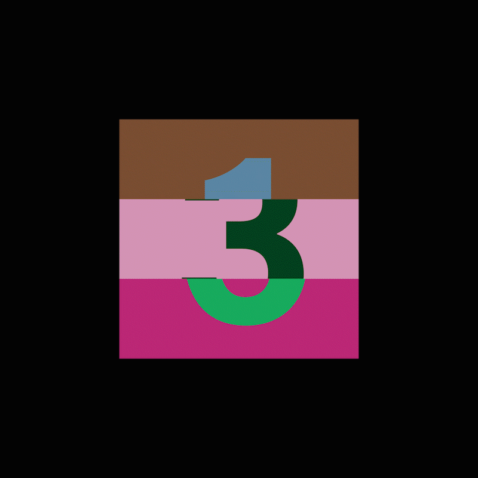
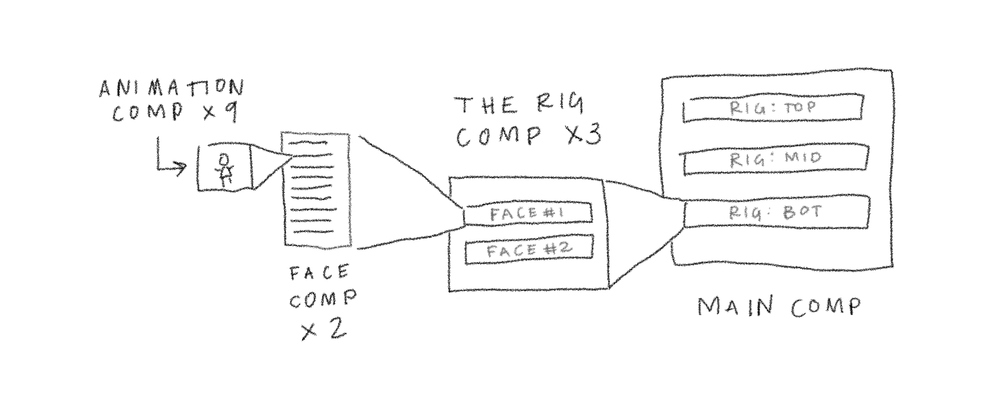

## The inspiration

I recently came across this animation by Andreas Bjørn Hansen (an animator
at BUCK) and was curious how he created the illusion of a 3D cube to fit
the piece's 2D design aesthetic.

I soon found out it is deceptively simple in it's presentation. In this
article I am going to explain three ways that I was able to recreate the rotating cube animation*, each solution increasing in difficulty but at the same
time allowing for more control.

*I won't be covering the character animations themselves, just the cube that spins and reveals them!

The hope is by following each solution you can get a sense of how I went
about solving this problem. If you think that's unnecessary (totally
fair!) feel free to skip around.

The three solutions are:

  <ol class="hide-shy-guy">
    <li><strong>Beginner: </strong>Rotating 3D layers</li>
    <li><strong>Intermediate: </strong>Non-uniformly scaling 2D layers</li>
    <li><strong>Advanced: </strong>Making a rig with Master Properties for more accuracy</li>
  </ol>

The introduction will walk you through the steps to create the master file that the three solutions start from. Note:

<ProjectFile>If you wish to skip the entire introduction, you may grab the
starter file <a href="#🤡">here</a>.</ProjectFile>

<Tabs>

  

<ProjectFile><AnchorLink offset="96" href="#here-we-go">Skip</AnchorLink> the blah blah blah and get straight to the introduction steps!</ProjectFile>

## The breakdown

Let's break down the animation so that we have some common vocabulary.
Things might get a little complicated to follow later so these terms
will be our guide. 🤠

To start, the animated cube consists of three sections; a top, a middle,
and a bottom.

It may also be worth noting that we only ever see three sides of each
section; a center, a right, and a left!

Each side of each section is playing its own animation, so, with
3 sections × 3 sides that makes 9 animations in total.

**In this article I won't be covering the animations themselves, just
the cube that presents them**, but taking a moment to think about their
application will help us build out our initial setup.

What do I mean by that?

Well, we could imagine that each one of these animations is not actually a dismembered body part of some being. There isn't an animation of _just_ a head, or torso, or legs.

Instead, somewhere exists an animation of a complete, fully connected character—we are just seeing ⅓ masked out and placed in either the top, center, or bottom section.

This is important because it determines how we will set up our project. This means that each side of our sections will have the same height and width as the entire cube BUT we'll only be seeing ⅓ masked out.

Okay, we may be getting ahead of ourselves. Before we get set up, let's simplify our problem a little, ya?

### Okay, let's simplify

Whoa, 3 sections with 3 sides each (totalling 9 animations) spinning around randomly is a lot to comprehend!

Luckily, if we look at our example again, we can see that each section (top, middle, and bottom) are performing nearly identical animations. They all *move* like the animation below, they just have different artwork inside each side.

So, for now, let's just forget about two of them, deal? Great.

Once we solve for one of the sections we can duplicate it (and offset the timing) to achieve the final result.

Just so we are on the same page, to start with I am going to be recreating the middle section. Feel free to start elsewhere, but know that some of the steps will be specifically referring to the middle section and its properties (its <Prop variant="ae">Position</Prop>, <Prop variant="ae">Anchor Point</Prop>, etc.)

### Let's get set up!

First things first, we need to create the three compositions that will house
our potential animations. For the sake of this article they will just
contain a background and a static number, but later you can drop
whatever you like inside.

As we talked about <AnchorLink offset="96" href="#the-breakdown">above</AnchorLink> these animations are of full
characters so while they look to be only ⅓ of the cube's side they
should really be 100% of the cube's side, also known as a square, hehe!

<ProjectFile>Reminder: if you'd like, you can also grab a starter file <a href="#🤡">here</a>.</ProjectFile>

### Here we go!

1.  Make a square composition named <Prop>Side 01</Prop>.
    - Its dimensions should be <Value>1080x1080px</Value>
    - With a framerate of <Value>30fps</Value>
    - And a duration of <Value>5</Value> seconds
2.  Add a Solid named Background.
    - Keyboard shortcut: ||Cmd|| + ||Y||
    - Color it with a random color. <Note>Note: for more flexibility color your solids with a Fill effect.</Note>
3.  Add a Text Layer with the text: <Value>1</Value>.
    - Size it up to fill one third of the composition
      <Note>
        Note: ||Option|| + ||'|| brings up your proportional grid which you can
        adjust by going to the After Effects Preferences > Grid & Guides... >
        Proportional Grid.
      </Note>
    - Center its position horizontally and vertically.
      <Note>
        Note: you can double click the text tool to create an automatically
        centered text layer.
      </Note>
    - Optional: I am going to color my text white and set its blending mode to Difference to ensure that it is always visible, no matter what the background color is.
4.  Duplicated the <Prop>Side 01</Prop> composition twice.
    - In your Project Panel, select the <Prop>Side 01</Prop> composition and hit Command + D twice.
      <Note>
        Note: because our composition ended in a number, After Effects will
        sequentially name our compositions for us!
      </Note>
    - It is a good idea to keep your Project Panel organized—make a folder called Sides and drag + drop our three comps into that folder.
5.  Change the background color and edit the text of both <Prop>Side 02</Prop> and <Prop>Side 03</Prop> compositions.
    - The text layer in <Prop>Side 02</Prop> should read <Value>2</Value>, etc.
6.  Create a new square composition named <Prop>Master</Prop>.
    - Its dimensions should be <Value>2160x2160px</Value>
    - With a framerate of <Value>30fps</Value>
    - And a duration of <Value>5</Value> seconds
    - In your Project Panel, make a folder called <Prop>Main</Prop> and drag + drop our new <Prop>Master</Prop> composition into it.
7.  Drag + drop all three <Prop>Side 0_</Prop> compositions into the new Master composition.
8.  Mask each layer such that only the middle ⅓ of each is visible.
    - Select the <Prop>Side 01</Prop> layer and double click the Rectangle Tool to create a mask that covers the whole layer.
    - Edit the mask to only reveal ⅓ of the layer:
    - In the Layer Panel, twirl down the newly made <Prop>Mask 1</Prop> on the <Prop>Side 01</Prop> layer.
    - Click on the blue <Prop>Shape…</Prop> text next to <Prop>Mask Path</Prop>.
    - Do some math.
        <Note>
          Note: in order to reveal the middle third of this layer (which is 1080px tall) the <>Top</> of the mask should be ⅓ of the way down (<>360</>) and the bottom should be ⅔ of the way down (<>720</>).
        </Note>
    - Copy <Prop>Mask 1</Prop> from the <Prop>Side 01</Prop> layer and paste it on the other two <Prop>Side 0_</Prop> layers.
9.  Ya done! 🎉
    - For now...

The middle section of our cube is complete! Now that we have everything organized we can start animating.

Just a reminder, from this <Prop>Master</Prop> composition we will create 3 solutions:

  <ol class="hide-shy-guy">
    <li><strong>Beginner: </strong>Rotating 3D layers</li>
    <li><strong>Intermediate: </strong>Non-uniformly scaling 2D layers</li>
    <li><strong>Advanced: </strong>Making a rig with Master Properties for more accuracy</li>
  </ol>

<AnchorLink offset="96" href="#tabs">
  Now that you've completed the master file, you're ready to jump in! Head back to the top to choose your path!
</AnchorLink>

  

  

<ProjectFile><AnchorLink offset="96" href="#building-our-faux-3d-box">Skip</AnchorLink> the blah blah blah and get straight to the beginner steps!</ProjectFile>

## The simple way

### ...with some caveats

What you see above is what we'll be making in this "beginner" solution.

Before we start, let's acknowledge that this does not 100% match our inspiration. Yes, it's a 3D exquisite corpse, BUT there are 2 things that clash with the original:

  <ol class="hide-shy-guy">
    <li>It doesn't respect the 2D design of the original.</li>
    <li>It is limited in the order in which each side is revealed.</li>
  </ol>

We'll go more in depth on these limitation in a bit, but for now ~hEEd ThoSe WaRnIngS~!

This is however, relatively quick to set up and is simple to control,
especially in comparison to the other two solutions. If that's your
style read on ahead, if not, skip to one of the other solutions!

### ...and some context

What we are about to build is a faux 3D object inside of After Effects.

The idea here is to place our 3 sides in 3D space in a box-like formation. By using math and a little helper layer we will accurately position them around an imaginary "center point" that we will rotate them around as a group:

[GIF explaining that idea]

Alright, here we go for real:

### Building our faux 3D box

1.  Duplicate the Master composition from the starter file and rename it to <Prop>3D Layers</Prop>.
2.  Inside of the <Prop>3D Layers</Prop> composition, we need to offset each of our <Prop>Side 0_</Prop> layer's <Prop>Anchor Points</Prop> in Z-space by ½ their width:
    - To get a better sense of what is happening in 3D space, in the Composition Panel, switch to <Value>Custom View 1</Value>
    - Select all three <Prop>Side 0_</Prop> layers, turn them into 3D layers by clicking the 3D Layer switch
    - Hit ||A|| on your keyboard to reveal their <Prop>Anchor Points</Prop>
    - We want to place their <Prop>Anchor Points</Prop> exactly at the center point of this imaginary cube that we are creating (for us that means <Value>540</Value> in Z-space!)
      <Note>
        How'd we get that? We need to take the "depth" of this cube and divide it in half. Lucky for us, we know the "depth"—it's the same size as our <>Side 0_</> layer's width—so, 1080/2 = 540. TL;DM: the Z value of each layer's anchor point should be 540
      </Note>
3.  Rotate each <Prop>Side 0_</Prop> layer on its Y axis into the "correct" position.
    - Select <Prop>Side 01</Prop>, hit R on your keyboard and rotate on the Y axis <Value>90°</Value>
    - Select <Prop>Side 03</Prop>, hit R on your keyboard and rotate on the Y axis <Value>-90°</Value>
4.  Create a Null layer to be able to control all three layers as a group:
    - Keyboard shortcut: ||Shift|| + ||Option|| + ||Command|| + ||Y||
    - Rename it to <Prop>Controller</Prop>
    - Turn it into a 3D layer
    - Parent all three <Prop>Side 0_</Prop> layers to the new <Prop>Controller</Prop> Null layer
5.  Animate the <Prop>Controller</Prop> Null's rotation on the Y axis.
    - In the <Prop>Composition Panel</Prop>, you may return to the <Value>Active Camera</Value> view
    - Select the <Prop>Controller</Prop> Null layer and hit ||R|| on your keyboard
    - On frame 10 set a keyframe for the Y Rotation at <Value>0</Value>
    - Hit ||Shift|| + ||Command|| + ||→|| twice to move forward 20 frames and set a keyframe at <Value>90</Value>
    - Hit ||Shift|| + ||Command|| + ||→|| three times to move forward 30 frames and repeat those keyframes, this time in reverse (first 90, then 30 frames later, 0).
    - You've got a loop!
6.  Now, to complete this animation you could...
    - Place your three complete character animations inside of the <Prop>Side 0_</Prop> compositions.
    - Repeat (or duplicate!) this process for the top and bottom sections.
    - Offset each section's <Prop>Controller</Prop> Null's rotation animations.

### Okay, neat

Okay, neat, but there are those problems we mentioned before:

  <ol class="hide-shy-guy">
    <li>It doesn't respect the 2D design the original.</li>
    <li>It is limited in the order in which each side is revealed.</li>
  </ol>

Regarding #1: you can see through the cube at its corners while it rotates (this [can sort of be solved](https://proloststore.com/products/edc), but probably not worth it because... this solution does not respect the 2D design language of the original!)

Regarding #2: we cannot break the order in which we reveal each face. That order
is built into the section of cube that we built with 3D layers (<Prop>Side 01</Prop>, then <Prop>Side 02</Prop>, then <Prop>Side 03</Prop>---or in reverse). In our example however, (here, in the top section) we see <Prop>Side 01</Prop>, then <Prop>Side 02</Prop>, then <Prop>Side 03</Prop>, then <Prop>Side 01</Prop> without seeing <Prop>Side 02</Prop> again!

What to do, what to do? 🤔 Weellll... if you're up for it you could try one of the other solutions:

  <ol class="hide-shy-guy">
    <li><strong>Intermediate: </strong>Non-uniformly scaling 2D layers</li>
    <li><strong>Advanced: </strong>Making a rig with Master Properties for more accuracy</li>
  </ol>

<AnchorLink offset="96" href="#tabs">
  Head back to the top to check out the intermediate or advanced steps!
</AnchorLink>

  

  

<ProjectFile><AnchorLink offset="96" href="#non-uniformly-scaling-our-2d-layers">Skip</AnchorLink> the blah blah blah and get straight to the intermediate steps!</ProjectFile>

## The true to 2D way

<!--
[GIF of final creation]

### ...with some caveats

This isn't super percise, there will be moments of eye-balling...

### ...and some context

This is because it’s not a cube—it just looks like one!

Instead, each face is a composition that is being scaled from one of its sides. Think of them as either left aligned or right aligned shapes. To complete the illusion of two sides of a cube making a 3D turn, as each face scales, they move out, and then back in.
-->

This setup is not only a convincing 3D turn that respects the 2D design language of the original (!) but it also allows us to sequence the sides in whatever order we like. These advantages, however, will cost us in complexity! This solution will be slightly more complicated to build and to control. Totes worth it, though.

So, to reiterate, at it simplest this solution consists of two steps for each face:
Non-uniformly scale your layer from one side.
As it scales, move your layer out from the center, and then back in.

### Non-uniformly scaling our 2D layers

Let's just focus on one "level". And more specifically, on one "face" of the "level" at a time. So, first we need to non-uniformly scale our layer:

1.  First, let’s duplicate our Master composition.
    - Rename the duplicate composition to Non-uniformly scaled Comps (or maybe something a little less nerdy) and double click to open it up.
2.  Set your anchor point to the edge of your initial "face" layer.
    - Select your initial "face" layer.
    - Hit Y on your keyboard.
    - Click and drag your layer's anchor point towards the left side of your layer.
    - Hold Command and it will snap to your layer's edge.
3.  Set an initial Scale keyframe.
    - Select your layer. Hit S on your keyboard.
    - Click the stopwatch.
4.  Set another Scale keyframe, this time with non-uniform proportions.
    - Move forward 20 frames (Shift + Page Down twice)
    - Unlink your scale proportions by clicking the link icon next to the blue text that says 100%, 100%.
    - Change the first value to 0%.
5.  Play back your animation and it now scales down to the left—we're halfway there!
6.  Now, set your anchor point to the edge of your second "face" layer.
    - This time the anchor point should be on the right.
7.  Apply the scale animation to the second “face” layer:
    - Copy your initial "face" layer's scale animation to this layer and then reverse them (Right Click > Keyframe Assistant > Time-reverse Keyframes).

Now our two layers scale non-uniformly in sync. But we need to move them out as they scale.

1.  Set start and end keyframes for the X Position of each "face" layer. These keyframes should be in sync with the previous Scale keyframes you made.
2.  In the middle of all these keyframes move the initial "face" layer to the left 100px and the second "face" layer to the right 100px.
3.  Oop, now there is a gap as they scale! Not to worry.
4.  In the middle keyframe adjust your scale values of each layer so that they meet in the middle of the gap.
5.  Now add some easing to the start and end keyframes and set the middle keyframes to auto-bezier. Should be pretty close.

### Debrief

Much better, right? But we could get more precise, right? And we could do this “non-destructively” so that we could swap in any video, animation, or image in any of the sides? Yeah, a little rig, that would be neat...

<AnchorLink offset="96" href="#tabs">
  Head back to the top to check out the advanced steps!
</AnchorLink>

  

  

<ProjectFile><AnchorLink offset="96" href="#the-rig">Skip</AnchorLink> the blah blah blah and get straight to the advanced steps!</ProjectFile>

## The precise way

What if we wanted to be pixel perfect in our animations? What if we needed to easily swap out our artwork? What if we wanted to show off how much we knew about After Effects?

In all of those scenarios we would want to create a "rig" that streamlines our animation workflow. 🤠

### The rig

Our rig will only contain one "level" of the cube. We will expose two inputs via Master Properties: one to choose which composition to start on and another to choose which composition to reveal. This way we can reuse the rig for all three "levels" of the cube and pick _any_ composition to reveal not limited by the cubes legitimate "construction".

Here is a quick diagram of our composition structure:

<ol class="hide-shy-guy">
  <li>We have our 9 animations inside of a "Face" composition.</li>
  <li>Our "Face" composition acts as a container that will allow us to choose which of our 9 animations we see.</li>
  <li>We place two instances of our "Face" composition inside our "Rig" composition, allowing us animate our container ONCE yet swap any two pieces of artwork we choose.</li>
  <li>We place three instances of our "Rig" composition into our "Main" comp, allowing us to build out our whole cube.</li>
</ol>

Shall we get started then?

1.  First, let’s duplicate our Master composition.
    - Rename the duplicate composition to The Rig 😎 and double click to open it up.
2.  Do another thing...

  

</Tabs>